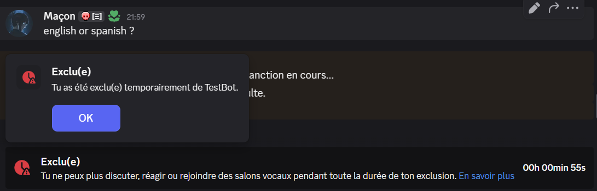

# 🤖 [BotDiscord] : Quiz Adaptatif et Modération

Ceci est un bot Discord développé en Python utilisant la librairie `discord.py`. Il propose un quiz de calcul mental à difficulté adaptative et intègre des fonctions de modération.

## 🌟 Fonctionnalités Principales

* **Quiz Adaptatif :** Un questionnaire de calcul mental où la progression et le niveau des questions changent en fonction de la réussite ou de l'échec de l'utilisateur.

* **Anti-Insulte avec Mute :** Détection d'insultes basées sur un fichier (`insultes.txt`) et sanction automatique par un **Timeout (mute)** temporaire de 1 minute.

* **Historique des Commandes :** Enregistrement et consultation des commandes utilisées par l'utilisateur stocké dans un fichier json.

* **Envoi de Fichier :** Envoi automatique d'un cours en PDF (`cours-maths.pdf`) en DM en cas d'échec à une question du quiz.

* **QUOI 'FEUR':** Répond 'FEUR' automatiquement lorsqu'un utilisateur emploie le mot "quoi" peu importe l'écriture s'il est detecté dans la phrase


## 🚀 Prérequis et Fichiers

| Fichier               |         Rôle         | Description                                         |
| :-------------------- | :------------------- | :-------------------------------------------------- |
| **`.env`**            | **Configuration**    | Doit contenir `TOKEN="VOTRE_TOKEN_DISCORD_ICI"`.    |
| **`insultes.txt`**    | **Modération**       | Liste des mots/phrases à détecter pour le mute.     |
| **`QUOI.txt`**        | **Troll**            | Liste des mots/phrases qui déclenchent le "FEUR !". |
| **`cours-maths.pdf`** | **Quiz**             | Fichier PDF envoyé en cas d'échec au quiz.          |

## ⚙️ Commandes Utilisateur

| Commande        |                                     Description                                             |
| :---------------| :-------------------------------------------------------------------------------------------|
| `!quizz`        |Démarre une nouvelle session de calcul mental adaptatif.                                     |
| `!history`      |Affiche l'historique de vos commandes passées.                                               | 
| `!lastCommande` |Affiche l'avant-dernière commande tapée dans l'historique.                                   |
| `!clearHistory` |Supprime l'historique de l'utilisateur. **Nécessite `!clearHistory true` pour confirmation.**|
| `!commande`     |Affiche toutes les commandes disponibles                                                     |

## Lancement du Bot
    Le bot n'étant pas hébergé sur un serveur, il faut donc d'abord executer la commande:
                ```python main.py```
    puis le bot devient fonctionnel.